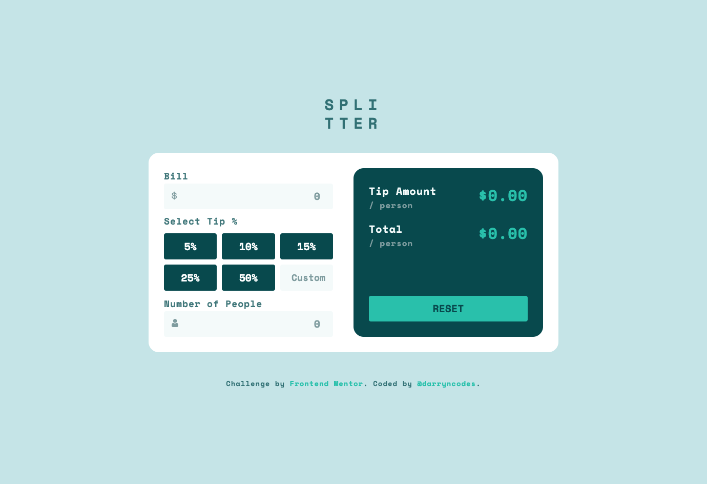
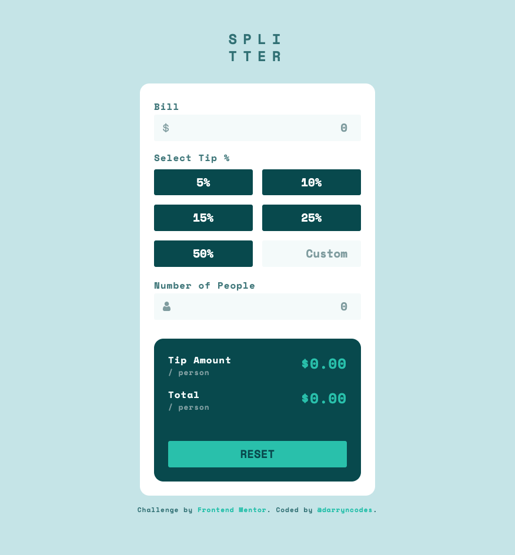

# Frontend Mentor - Tip calculator app solution

This is a solution to the [Tip calculator app challenge on Frontend Mentor](https://www.frontendmentor.io/challenges/tip-calculator-app-ugJNGbJUX). Frontend Mentor challenges help you improve your coding skills by building realistic projects.

## Table of contents

- [Overview](#overview)
  - [The challenge](#the-challenge)
  - [Screenshot](#screenshot)
  - [Links](#links)
- [My process](#my-process)
  - [Built with](#built-with)
  - [Useful resources](#useful-resources)
- [Author](#author)

**Note: Delete this note and update the table of contents based on what sections you keep.**

## Overview

### The challenge

Users should be able to:

- View the optimal layout for the app depending on their device's screen size
- See hover states for all interactive elements on the page
- Calculate the correct tip and total cost of the bill per person

### Screenshot

### Links

- [GitHub repo](https://github.com/darryncodes/tip-calculator-app)
- [Solution URL](https://darryncodes.github.io/tip-calculator-app/)

## My process

### Built with

- Semantic HTML5 markup
- SCSS
- JS
- Flexbox
- Grid
- Mobile-first workflow
- BEM methodology

### Useful resources

- [MDN - .toFixed](https://developer.mozilla.org/en-US/docs/Web/JavaScript/Reference/Global_Objects/Number/toFixed)

## Author

- Work in progress portfolio site - [@darryncodes](https://www.darryncodes.co.uk/)
- Frontend Mentor - [@darryncodes](https://www.frontendmentor.io/profile/darryncodes)
- Twitter - [@darryncodes](https://twitter.com/darryncodes)
